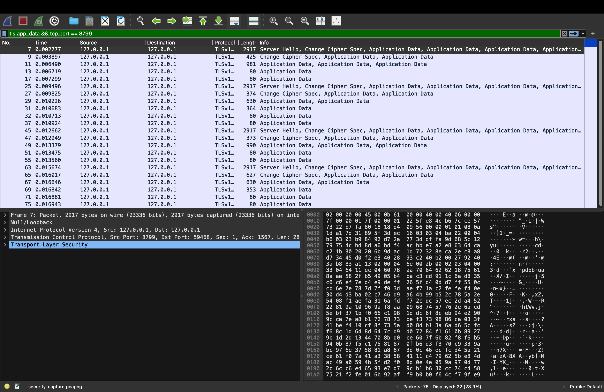
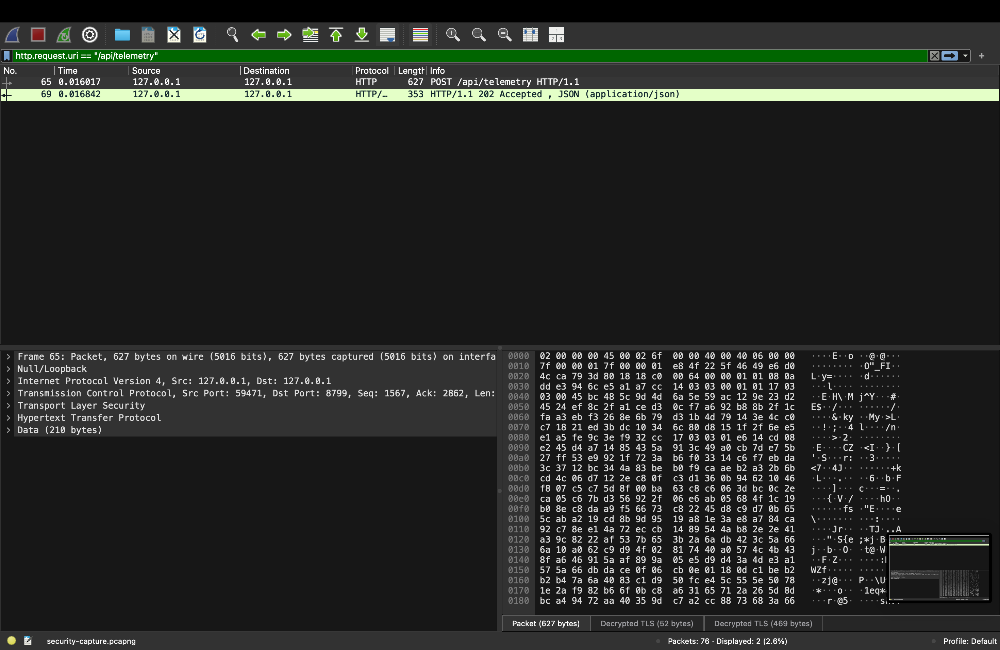

# Local Sensor Cloud

Local Sensor Cloud turns an Android phone into a wireless sensing and camera device. The phone collects its available sensor measurements, noise level, battery and device information, and front/back camera images. It displays the live values on the phone and sends encrypted uploads over the local Wi-Fi network to a laptop.

The laptop acts as the cloud server. It decrypts and stores the uploads, then provides a browser dashboard with live sensor readings and camera feeds. No external cloud service or upload token is required.

## What the app does

- Discovers the sensors available on the phone and creates a live card for each one automatically.
- Displays noise level, pressure, battery information, camera status, upload counts, and errors on the phone.
- Captures the front and back cameras. Supported phones can use both concurrently; other phones alternate between them automatically.
- Automatically uploads sensor data and photos at separate user-selected intervals in seconds or minutes.
- Provides a manual photo-capture button for an immediate saved image.
- Keeps sensor values updating locally even when the laptop cannot be reached.
- Shows connected devices, measurements, and the latest camera images on the laptop dashboard.
- Saves telemetry as JSONL and camera images as JPEG files on the laptop.

<details>
<summary><strong>Security: Wi-Fi, pinned TLS and AES-GCM</strong></summary>

## Security

### Basic terms

- **Encryption** changes readable data into unreadable data. **Decryption** changes it back. A **key** is a secret value used to perform these operations.
- **TLS (Transport Layer Security)** is the security system used by HTTPS. It creates an encrypted connection between two devices, so someone observing the network cannot read the exchanged data. It also uses a certificate to identify the server.
- **Certificate pinning** means the Android app remembers the exact laptop certificate it saw during approved pairing. After that, the app refuses a connection if another server presents a different certificate.
- **AES-GCM (Advanced Encryption Standard in Galois/Counter Mode)** is a method for encrypting a message with a shared secret key. AES hides the message, while GCM adds a check that detects whether anyone changed it. The app uses a new random value for every upload so identical data does not produce identical encrypted output.

TLS and AES-GCM both use encryption, but at different places. TLS creates a protected connection, while application-level AES-GCM protects the sensor data and images themselves before they enter that connection.

### Protection layers

The app uses three security layers, and each one protects a different part of the data path:

- **Wi-Fi layer — implemented by Android and the router or hotspot:** WPA protects radio traffic between the phone and the Wi-Fi access point. The app does not create this encryption; the Wi-Fi system provides it when the network is secured.
- **Connection layer — implemented by TLS in the Android app and laptop server:** TLS encrypts everything travelling between the app and laptop. Certificate pinning also lets the app confirm that it connected to the correct laptop.
- **Data layer — implemented by AES-GCM inside the Android app and laptop server:** The app encrypts each sensor upload and camera image before sending it. The laptop checks and decrypts the data after receiving it, so modified data is rejected.

In simple terms, AES-GCM protects the actual sensor data and images, TLS protects their complete phone-to-laptop journey, and WPA protects the wireless part of that journey.

The APK is general: the same app can connect to different laptops. It contains no laptop certificate and no shared upload key. During first-time pairing, the laptop displays a connection request and both screens display a six-digit code. When the user verifies that the codes match and chooses **Approve**, the app pins that laptop's certificate and receives a new AES key created only for that phone. Android protects the saved key with its system keystore, and the laptop keeps its paired-phone keys outside Git.

</details>

<details>
<summary><strong>Complete installation and setup guide</strong></summary>

## Start from scratch

### 1. Install the required tools

The project needs Git, Node.js with npm, Android Studio, ADB, and OpenSSL. Follow the section for your laptop's operating system.

#### Windows

1. Open **PowerShell**. Use these commands to install Git, Node.js, and Android Studio with Windows Package Manager:

   ```powershell
   winget install --id Git.Git -e --source winget
   winget install --id OpenJS.NodeJS.LTS -e --source winget
   winget install --id Google.AndroidStudio -e --source winget
   ```

   If `winget` is unavailable, use the official [Git](https://git-scm.com/install/windows), [Node.js](https://nodejs.org/en/download), and [Android Studio](https://developer.android.com/studio/install) installers instead.

2. Start Android Studio and complete its Setup Wizard. On the welcome screen, select **More Actions → SDK Manager → SDK Tools**, enable **Android SDK Platform-Tools**, and select **Apply**. Platform-Tools contains ADB.

3. Open **Git Bash**, which was installed with Git. Add ADB to its command path:

   ```bash
   echo 'export PATH="$PATH:/c/Users/$USERNAME/AppData/Local/Android/Sdk/platform-tools"' >> ~/.bashrc
   source ~/.bashrc
   ```

   Git Bash includes OpenSSL and will be used for the remaining Windows commands in this guide.

4. Confirm that all tools are available:

   ```bash
   git --version
   node --version
   npm --version
   adb --version
   openssl version
   ```

   If ADB cannot detect the phone later, install the phone manufacturer's USB driver as described in the [Android hardware-device guide](https://developer.android.com/studio/run/device).

#### macOS

1. Open **Terminal** and install Apple's command-line tools:

   ```bash
   xcode-select --install
   ```

2. Install [Homebrew](https://brew.sh/), then follow the **Next steps** printed by its installer so the `brew` command is added to the shell path:

   ```bash
   /bin/bash -c "$(curl -fsSL https://raw.githubusercontent.com/Homebrew/install/HEAD/install.sh)"
   ```

3. Close and reopen Terminal. Install Git, Node.js, OpenSSL, and Android Studio:

   ```bash
   brew install git node openssl@3
   brew install --cask android-studio
   ```

   Android Studio can also be installed from the official [Android Studio installation page](https://developer.android.com/studio/install). Open it and complete the Setup Wizard. Then select **More Actions → SDK Manager → SDK Tools**, enable **Android SDK Platform-Tools**, and select **Apply**. Platform-Tools contains ADB.

4. Add Homebrew OpenSSL and ADB to the command path:

   ```bash
   echo 'export PATH="$(brew --prefix openssl@3)/bin:$PATH"' >> ~/.zshrc
   echo 'export ANDROID_HOME="$HOME/Library/Android/sdk"' >> ~/.zshrc
   echo 'export PATH="$PATH:$ANDROID_HOME/platform-tools"' >> ~/.zshrc
   source ~/.zshrc
   ```

5. Confirm that all tools are available:

   ```bash
   git --version
   node --version
   npm --version
   adb --version
   openssl version
   ```

#### Linux

For Ubuntu or Debian, open a terminal and run:

```bash
sudo apt update
sudo apt install -y git nodejs npm openssl unzip android-sdk-platform-tools-common
```

For Fedora, run:

```bash
sudo dnf install -y git nodejs npm openssl unzip android-tools
```

Download Android Studio from the official [Android Studio installation page](https://developer.android.com/studio/install). After downloading the Linux archive, install and open it with:

```bash
cd ~/Downloads
tar -xzf android-studio-*-linux.tar.gz
sudo mv android-studio /opt/
/opt/android-studio/bin/studio
```

Complete the Android Studio Setup Wizard. Then select **More Actions → SDK Manager → SDK Tools**, enable **Android SDK Platform-Tools**, and select **Apply**.

Add the Android SDK and ADB to the command path:

```bash
echo 'export ANDROID_HOME="$HOME/Android/Sdk"' >> ~/.bashrc
echo 'export PATH="$PATH:$ANDROID_HOME/platform-tools"' >> ~/.bashrc
source ~/.bashrc
```

On Ubuntu or Debian, allow the current user to access Android USB devices, then log out and back in:

```bash
sudo usermod -aG plugdev "$LOGNAME"
```

Confirm that all tools are available:

```bash
git --version
node --version
npm --version
adb --version
openssl version
```

The official [Android Platform-Tools page](https://developer.android.com/tools/releases/platform-tools) also provides separate ADB downloads for Windows, macOS, and Linux.

### 2. Download the project

On Windows, open Git Bash. On macOS or Linux, open a terminal. Then run:

```bash
git clone https://github.com/seonabrar804/local-sensor-cloud.git
cd local-sensor-cloud
chmod +x setup-security.command start-server.command android/gradlew
```

### 3. Find the laptop's local address

The phone and laptop must be on the same Wi-Fi network.

On Windows, open PowerShell and run:

```powershell
ipconfig
```

Find the active Wi-Fi adapter and copy its **IPv4 Address**.

On macOS, run:

```bash
ipconfig getifaddr en0
```

If that prints nothing, open **System Settings → Wi-Fi → Details** and copy the IP address.

On Linux, run:

```bash
hostname -I
```

Use the first local address printed for the active network connection.

The address normally looks similar to `192.168.1.20`. It can change when the laptop joins another network.

### 4. Generate the laptop TLS certificate

On Windows, use Git Bash and supply the laptop address found in the previous step:

```bash
SENSOR_CLOUD_IP=192.168.1.20 bash setup-security.command
```

On macOS or Linux, run:

```bash
SENSOR_CLOUD_IP=192.168.1.20 ./setup-security.command
```

Replace `192.168.1.20` with the laptop's actual address. The script creates this laptop's TLS certificate and private key. It does not place either one in the Android app.

Do not share or commit the TLS private key or files from `server/keys/`. The server creates a separate AES key in that directory for each phone you approve.

### 5. Build the Android app

On Windows, run these commands in Git Bash:

```bash
cd android
export JAVA_HOME="/c/Program Files/Android/Android Studio/jbr"
./gradlew.bat assembleDebug
cd ..
```

On macOS, run:

```bash
cd android
export JAVA_HOME="/Applications/Android Studio.app/Contents/jbr/Contents/Home"
./gradlew assembleDebug
cd ..
```

On Linux, run:

```bash
cd android
export JAVA_HOME=/opt/android-studio/jbr
./gradlew assembleDebug
cd ..
```

The generated APK is:

```text
android/app/build/outputs/apk/debug/app-debug.apk
```

If Android Studio was installed in another directory, change `JAVA_HOME` to its `jbr` directory. If Java is already configured, setting `JAVA_HOME` is unnecessary. You can also open the `android` directory in Android Studio and build the app there.

This APK is reusable. It is not tied to the certificate, address, or AES key of the laptop that built it.

### 6. Install the app on the phone

Choose a GitHub download, a download from your laptop, or USB installation.

#### Download the reusable APK from GitHub

On the Android phone, open this link and install the downloaded file:

[Download Local Sensor Cloud for Android](https://github.com/seonabrar804/local-sensor-cloud/releases/latest/download/LocalSensorCloud.apk)

Android may ask you to allow installation from the browser or file manager. This is the same reusable APK for every laptop; the app learns the correct laptop certificate and phone-specific encryption key only after pairing is approved.

#### Direct download from the laptop

This is the easiest method when the phone and laptop are on the same Wi-Fi network:

1. Start the laptop server as shown in step 7.
2. On the phone, open `https://LAPTOP_IP:8787` in a browser, replacing `LAPTOP_IP` with the address found in step 3.
3. Tap **Download Android APK** on the dashboard. The direct download address is `https://LAPTOP_IP:8787/app-debug.apk`.
4. Open the downloaded `LocalSensorCloud-debug.apk` and allow installation from the browser when Android asks.

The laptop download and GitHub download contain the same general app. Neither contains the laptop's private key or any phone's AES key.

#### Install with USB and ADB

Enable **Developer options** and **USB debugging** on the Android phone, connect it by USB, accept the authorization message, and run:

```bash
adb devices
adb install -r android/app/build/outputs/apk/debug/app-debug.apk
```

You can also copy `android/app/build/outputs/apk/debug/app-debug.apk` to the phone manually, open it, and allow installation from that file source when Android asks.

### 7. Start the laptop server

On Windows, run this from the project directory in Git Bash:

```bash
bash start-server.command
```

On macOS or Linux, run:

```bash
./start-server.command
```

Leave that terminal window open. On the laptop, visit:

```text
https://localhost:8787
```

The browser may warn about a self-signed certificate because it was created locally rather than by a public certificate authority. Proceed only when you are using the certificate generated by this project.

If the firewall asks whether Node.js may accept incoming connections, allow it on the local network.

### 8. Connect the Android app

1. Confirm that the phone and laptop are connected to the same Wi-Fi network.
2. On the laptop, keep `https://localhost:8787` open. Approval is allowed only from this local dashboard, not from another phone or computer.
3. Open **Local Sensor Cloud** on the phone and enter the laptop URL using the address from step 3, for example `https://192.168.1.20:8787`.
4. Tap **Pair / re-pair laptop**, or tap **Start streaming** to send a pairing request automatically.
5. A six-digit verification code appears on the phone. Find the pending phone request on the laptop dashboard and confirm that its code is exactly the same.
6. If the codes match, choose **Approve** on the laptop. Choose **Deny** if the phone is unfamiliar or the codes differ.
7. After approval, grant the camera, microphone, and notification permissions requested by Android.
8. Select the sensor-data and automatic-photo intervals, then tap **Start streaming**. Each interval can use seconds or minutes.

No sensor, microphone, or camera capture starts before the laptop approves the phone. The app obtains the phone model, Android information, battery status, sensors, and camera capabilities directly from the phone. Nothing needs to be entered manually except the laptop address and upload intervals.

The same APK can pair with another laptop later. Run that laptop's server, enter its HTTPS address, and repeat the code comparison and approval. Pairings are saved separately for each laptop address and phone ID.

</details>

<details>
<summary><strong>How to use the Android app</strong></summary>

## Using the app

- **Start streaming** opens the available sensors, microphone, and cameras and starts scheduled encrypted uploads.
- **Capture photo** saves the next camera image immediately on the laptop.
- **Stop** closes the active sensors, microphone, cameras, and background service.
- Sensor cards appear automatically according to the hardware available on the phone.
- A missing pressure, temperature, humidity, or other reading usually means the phone does not contain that physical sensor.

The noise value is a relative digital microphone level. It is not a calibrated sound-pressure measurement unless the phone is calibrated against a known meter.

</details>

<details>
<summary><strong>Where sensor data and photos are stored</strong></summary>

## Stored data

The laptop creates the following directories while the server runs:

```text
server/data/
├── telemetry/   daily JSONL sensor logs
├── frames/      latest image from each camera
└── photos/      timestamped automatic and manual photos
```

Each telemetry line is standalone JSON and can later be loaded into Python, a spreadsheet, a database, or another analysis tool.

</details>

<details>
<summary><strong>Wireshark encryption checks and screenshots</strong></summary>

## Confirming encryption with Wireshark

Start a Wireshark capture on the laptop's active Wi-Fi interface and use this display filter:

```text
tcp.port == 8787
```

Wireshark should identify the connection as TLS and show the uploads as encrypted application data. It can still display addresses, ports, timing, and packet sizes, but it should not display readable sensor values or JPEG contents. WPA encryption is normally removed by the Wi-Fi hardware before packets reach a normal laptop capture, and the inner AES-GCM payload remains hidden inside TLS.

### Verified security evidence

The security path was checked with a controlled upload through an isolated temporary server. The temporary server used port `8799`; the normal app continues to use port `8787`. No TLS decryption keys, paired-phone keys, packet captures, or test records are stored in this repository.

| Security layer | Verification result |
| --- | --- |
| Wi-Fi link | macOS reported the active Wi-Fi connection as `WPA2_PSK`, confirming that link-layer encryption was enabled by the access point. This setting belongs to the Wi-Fi network, not the Android app. |
| Pinned TLS | The capture showed TLS application data rather than readable HTTP, sensor JSON, or images. The pairing and upload tests also reject unapproved devices. |
| Application AES-GCM | Temporary TLS test keys were loaded into Wireshark so the outer HTTP request could be inspected. Even then, the telemetry body remained an opaque 210-byte `LSC2` AES-GCM envelope. The server accepted it with HTTP `202` only after authenticated decryption; tampered ciphertext is rejected by the automated tests. |

The normal network view below shows TLS-protected application data. The bytes pane does not contain readable telemetry.



The second view deliberately decrypts only the outer TLS layer using temporary test keys. Wireshark can then identify `POST /api/telemetry`, but the inner payload is still shown as opaque `Data (210 bytes)` because AES-GCM protects the application data separately. The `202 Accepted` response confirms that the server authenticated and decrypted the envelope.



</details>

<details>
<summary><strong>Troubleshooting</strong></summary>

## Troubleshooting

### The app cannot connect

- Confirm that the server is still running and the laptop URL is correct.
- Confirm that both devices are on the same network.
- Avoid guest Wi-Fi networks that isolate connected devices.
- Allow incoming Node.js connections through the laptop firewall.
- Open the dashboard locally to confirm the server started successfully.

### Uploads fail after the laptop address changes

Enter the new HTTPS address in the app and pair again. Compare the new six-digit code and approve the request on the laptop. The APK does not need to be rebuilt or reinstalled.

Use `./setup-security.command --force` only when you intentionally replace the laptop certificate. Every phone must pair again after the certificate changes.

### Camera images are dark or unavailable

- Grant camera permission and stop/start streaming again.
- Keep the lenses uncovered and allow a moment for exposure adjustment.
- Some phones cannot open both cameras simultaneously; the app alternates between them automatically.

### A sensor card is missing

Android can only report hardware physically present in the phone. A missing sensor is expected and does not indicate an upload failure.

</details>

<details>
<summary><strong>Developer test commands</strong></summary>

## Test commands

Test the laptop receiver:

```bash
cd server
npm test
```

To build the Android app again, repeat step 5 for Windows or Linux.

</details>

<details>
<summary><strong>Important security rules</strong></summary>

## Important security rules

- Do not commit the TLS private key, paired-phone AES keys, sensor recordings, photos, or packet captures.
- Do not expose the laptop server port directly to the public internet.
- Approve a phone only when the six-digit code on the phone exactly matches the laptop dashboard.
- Replacing the laptop certificate requires phones to pair again, but the APK does not need to be rebuilt.
- The app does not use an upload token. Keep the server on a trusted local network.
- Every approved phone receives a different AES key; no shared AES key is embedded in the APK.

</details>
